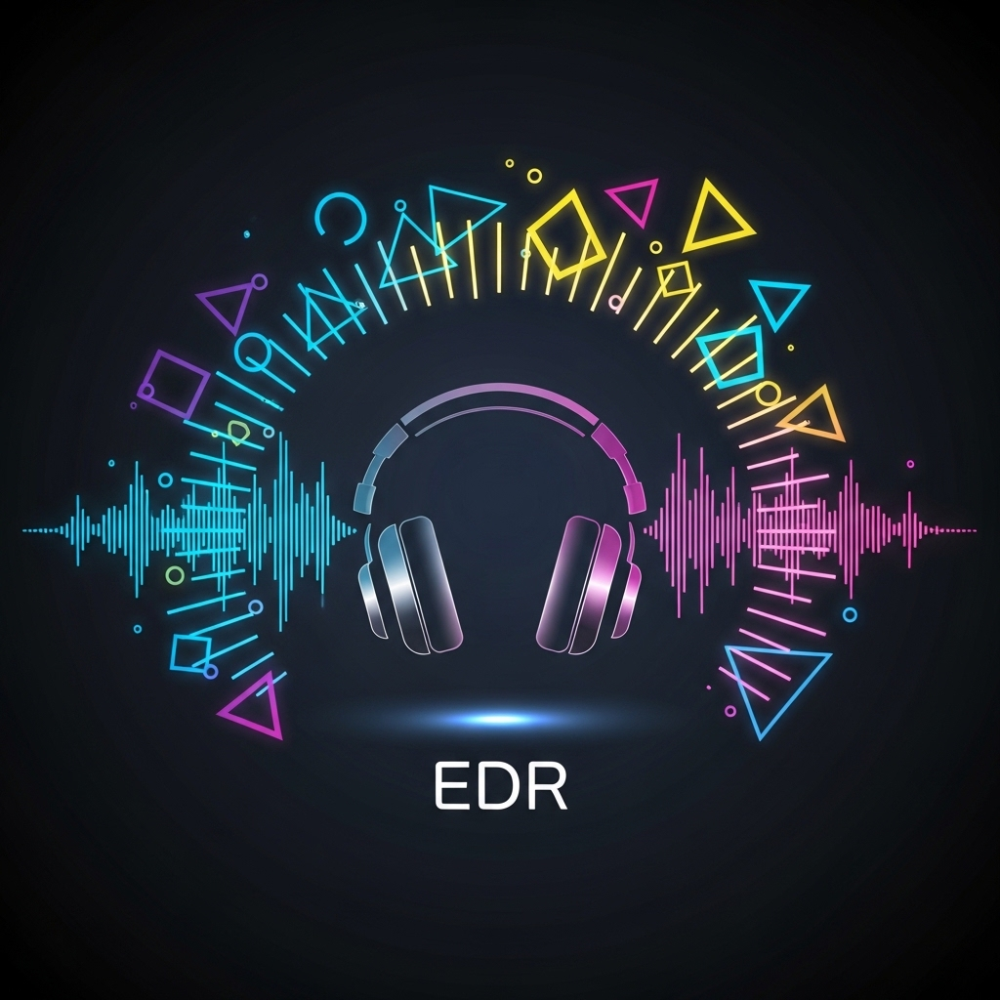
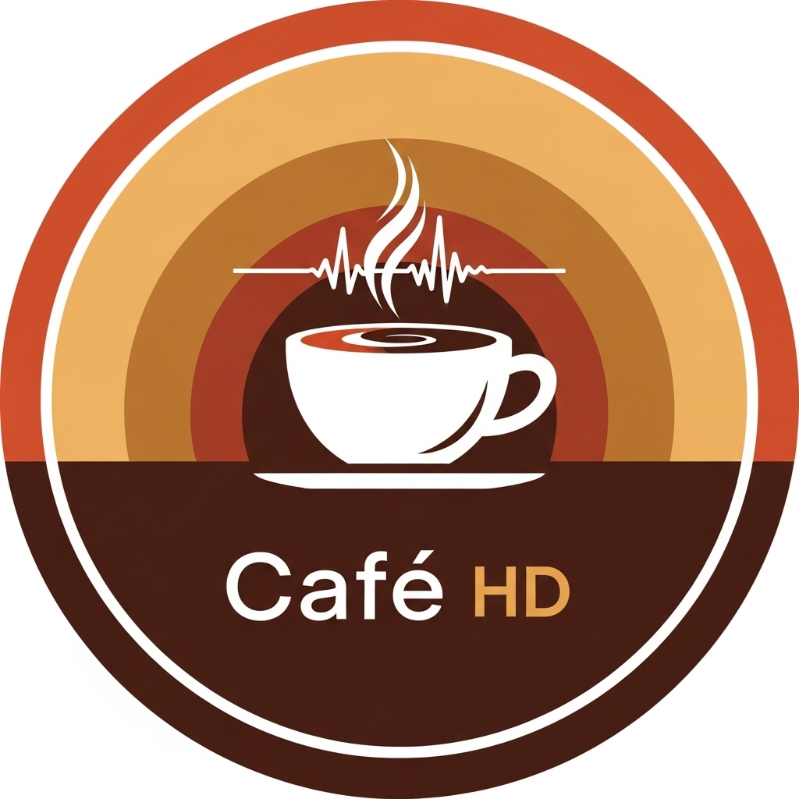
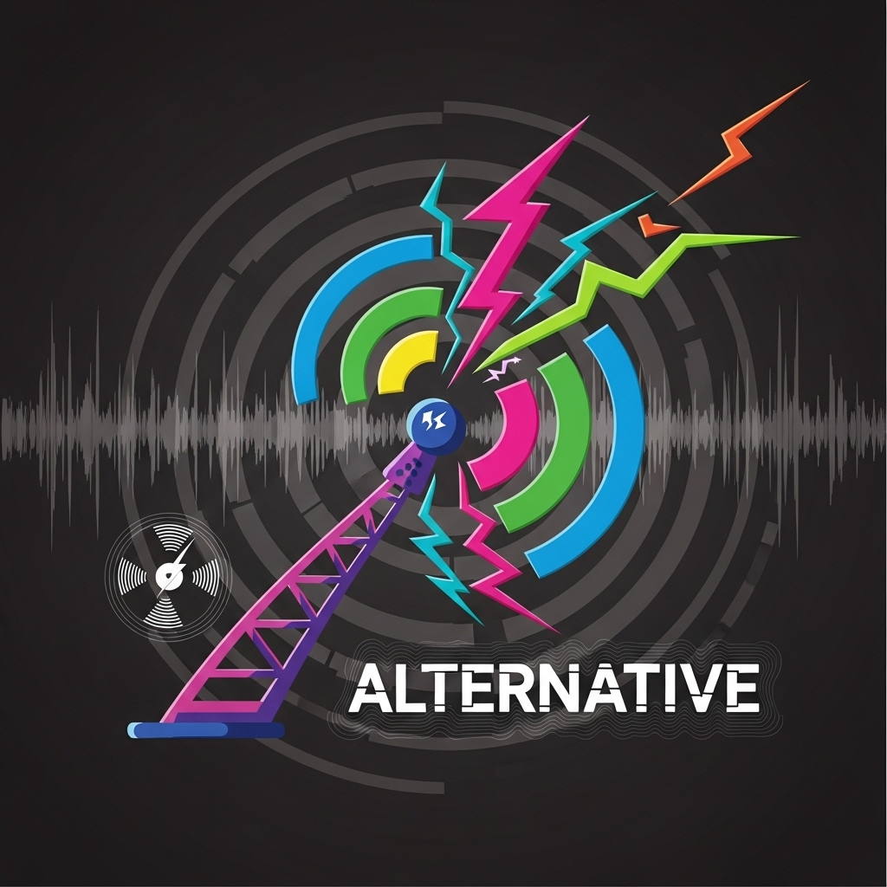
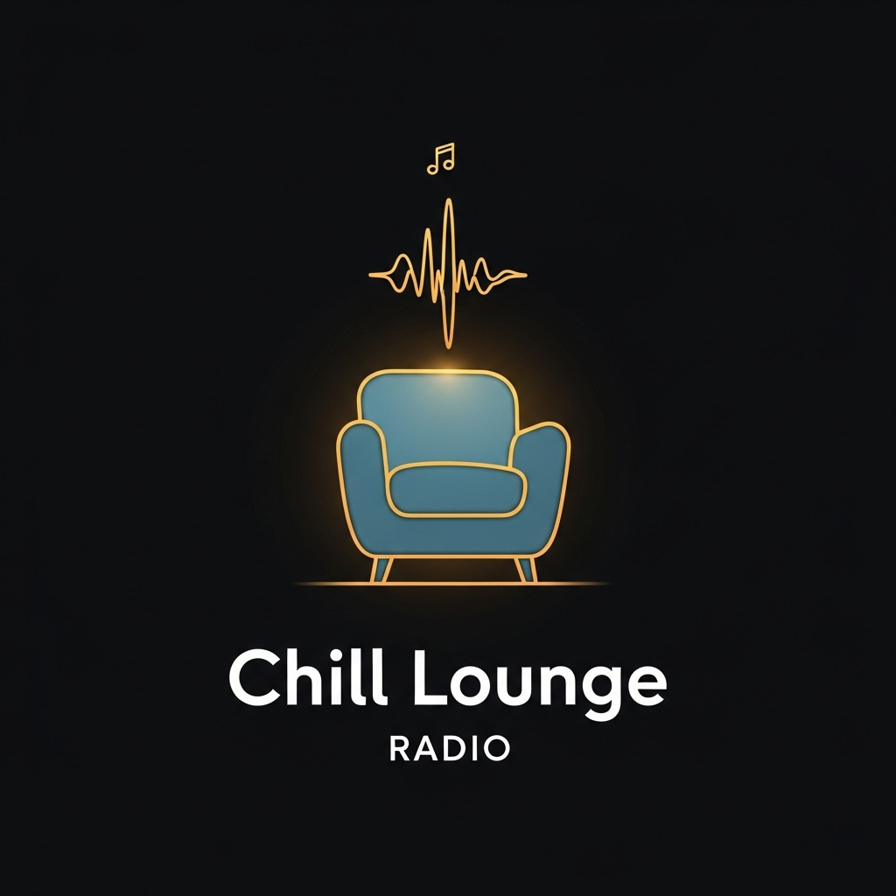
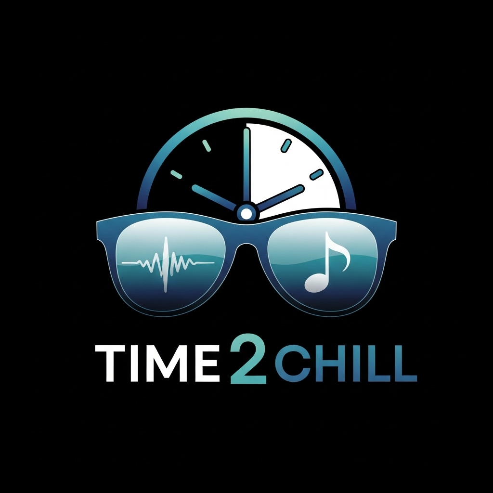
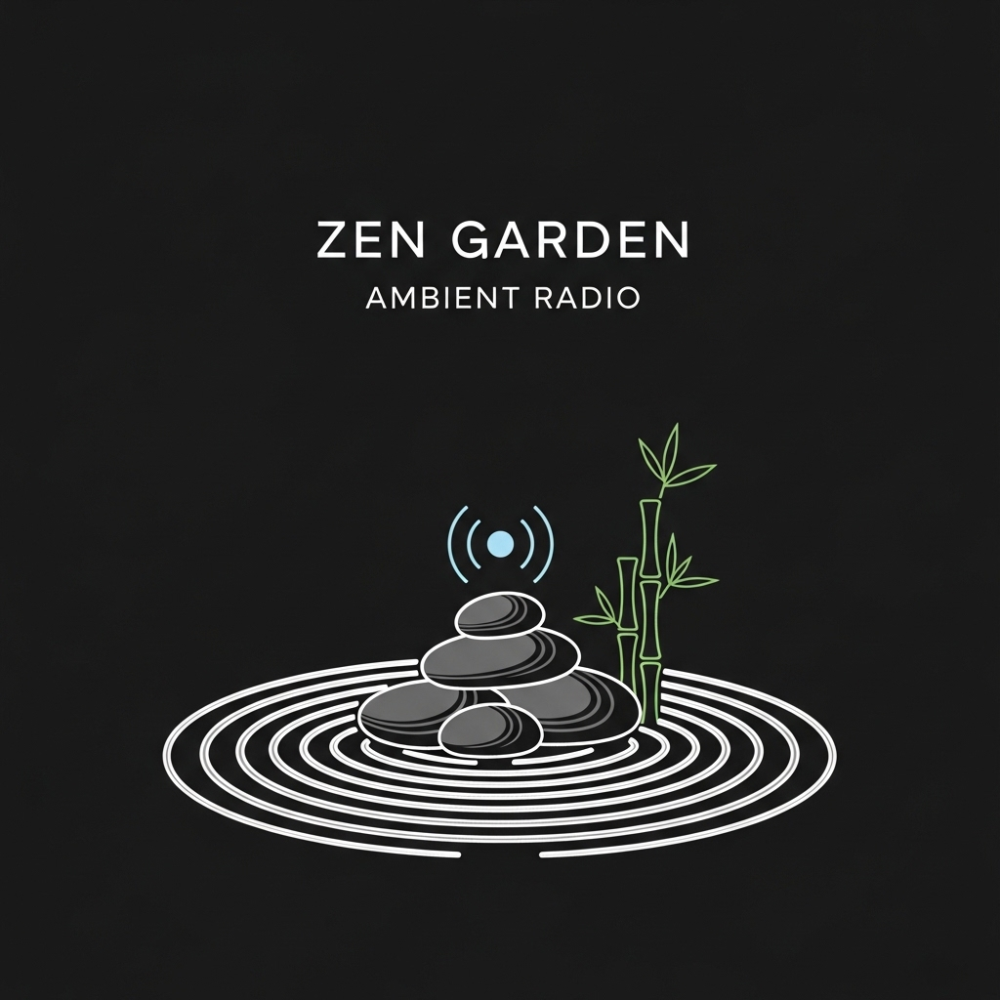

# Slightly Epic Radio - Android

An internet radio player for Android featuring 14 curated stations across multiple genres. This is the Android companion to the [Slightly Epic Radio Roku app](../Slightly-Epic-Radio-Roku-).

## Stations

| Icon | Station | Genre | Format | Stream URL |
|------|---------|-------|--------|------------|
|  | Slightly Epic Mashups | Mashups / Multi-genre | MP3 | https://a6.asurahosting.com:6520/radio.mp3 |
|  | K.G.L.W. Bootlegger | Rock / Live Bootlegs | MP3 | https://gizzradio.live/listen/listen/radio.mp3 |
|  | EDM Techno Forever | EDM / Techno | MP3 | http://ec1.yesstreaming.net:3500/stream |
|  | Electronic Dance Radio | EDM | MP3 | http://mpc1.mediacp.eu:18000/stream |
|  | The Epic Channel | Progressive Rock | MP3 | http://fra-pioneer08.dedicateware.com:1100/stream |
|  | Classical Public Domain Radio | Classical | MP3 | http://relay.publicdomainradio.org/classical.mp3 |
|  | Cafe HD | Various / Background | AAC | http://live.playradio.org:9090/CafeHD |
|  | Badlands Classic Rock | Classic Rock | AAC | http://ec3.yesstreaming.net:2040/stream |
|  | UTurn Classic Rock | Classic Rock | MP3 | http://listen.uturnradio.com:7000/classic_rock |
|  | Alternative | Alternative Rock | AAC | http://stream.xrm.fm:8000/xrm-alt.aac |
|  | Chill Lounge | Chill / Lounge | AAC | http://harddanceradio.ddns.is74.ru:8000/lounge |
|  | Time 2 Chill Radio | Chill / Ambient | MP3 | http://ec6.yesstreaming.net:3610/stream |
|  | Ultimate Chill | Chill Pop | MP3 | http://ec1.yesstreaming.net:3290/stream |
|  | Zen Garden | New Age / Ambient | MP3 | https://kathy.torontocast.com:3250/stream |

## Features

- Stream 14 internet radio stations (MP3 and AAC)
- Live now-playing metadata (song title and artist) via Icecast and Shoutcast endpoints, polled every 20 seconds
- Background playback with Android media notification controls
- Lock screen display showing current song/artist and station name
- Remembers last played station between app launches
- Dark theme UI with station artwork and horizontal station selector

## Tech Stack

- **Language:** Kotlin
- **UI:** Jetpack Compose + Material 3
- **Audio:** AndroidX Media3 (ExoPlayer) with MediaSessionService
- **Networking:** OkHttp (metadata fetching)
- **Preferences:** Jetpack DataStore
- **Min SDK:** 24 (Android 7.0)
- **Target SDK:** 34 (Android 14)

## Project Structure

```
app/src/main/java/com/slightlyepic/radio/
├── RadioApplication.kt                 # Application class
├── data/
│   ├── Station.kt                      # Station model and repository
│   ├── MetadataFetcher.kt              # Icecast/Shoutcast metadata parser
│   └── PreferencesManager.kt           # Last station persistence
├── service/
│   └── RadioPlaybackService.kt         # Background audio via MediaSession
└── ui/
    ├── MainActivity.kt                 # MediaController lifecycle
    ├── RadioViewModel.kt               # UI state and playback coordination
    ├── RadioScreen.kt                  # Compose UI
    └── theme/
        └── Theme.kt                    # Dark color scheme
```

## Building

1. Open the `SlightlyEpicRadioAndroid` folder in Android Studio
2. Let Gradle sync complete
3. Run on a device or emulator (API 24+)

The debug APK is output to:
```
app/build/outputs/apk/debug/app-debug.apk
```

For a signed release build, use **Build > Generate Signed Bundle / APK** in Android Studio.

## Installing the APK

To sideload the APK onto a phone:

1. Transfer the APK file to your phone (USB, email, Google Drive, etc.)
2. Open the file on your phone
3. Enable "Install from unknown sources" when prompted
4. Tap Install

## Permissions

- **INTERNET** - streaming audio and fetching metadata
- **FOREGROUND_SERVICE / FOREGROUND_SERVICE_MEDIA_PLAYBACK** - background audio playback
- **POST_NOTIFICATIONS** - media playback notification (Android 13+)
